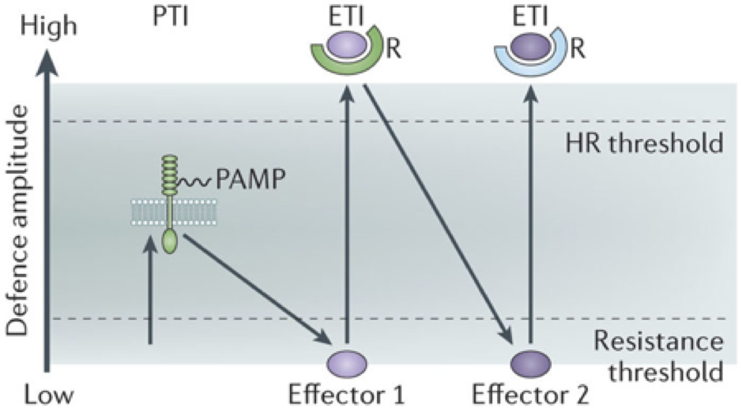
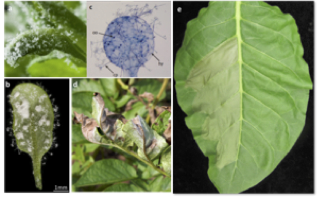

# Resistance Proteins {-}

**Led by Jonathan Jones**

*Plant Resistance Genes, Proteins and Mechanisms*

Lorem ipsum dolor sit amet, consectetur adipiscing elit. In iaculis sagittis metus quis malesuada. Vestibulum laoreet vel tortor at tempor. Mauris blandit volutpat risus, et placerat odio varius eget. Cras vitae diam sollicitudin justo vehicula ultrices. Curabitur consequat ornare odio ac hendrerit. Mauris bibendum diam nec gravida molestie. Nullam interdum, nulla eget sollicitudin elementum, ante lorem auctor odio, sit amet varius diam magna et lectus. Sed vehicula velit velit, convallis mollis erat laoreet nec. Cras semper blandit felis vel iaculis. Sed in mollis nulla. Nulla sed egestas odio, nec finibus lectus. In vel porttitor lacus, nec tincidunt neque. Suspendisse at magna non neque congue fermentum at ut augue. Vivamus suscipit finibus tortor, ut accumsan dui pretium nec. Integer luctus eros non convallis ornare.


```{r rpmain, echo=FALSE, fig.cap="This image should really be one that nicely summarises your topic. Not Roger.", dpi=96 }
knitr::include_graphics("assets/RPF-thumbnail.jpeg")
```

## Keynote Lecture {-}

### Jijie Chai - Structural Study of Plant Receptor Kinases {-}
**Max Planck Institute for Breeding Research, University of Cologne**

Plant receptor kinases (RKs) are a large family of single transmembrane proteins that play important roles in diverse biological processes including development, growth and immunity. RKs are characterized with diversified extracellular domains (ECDs) and conserved intracellular kinase domains. Recognition of their cognate ligands by ECDs of RKs initiates activation of RKs. The molecular mechanisms underlying this process remained poorly defined. We recently solved the crystal structures of the ECDs derived from several RKs in complex with their respective ligands. These structures define the molecular mechanisms by which these RKs recognize their specific ligands. More importantly, a general mechanism underlying ligand-induced activation of RKs can be formulated. In the current talk, I will briefly review what we have done on structural study of RKs and present two examples of how RK activation and ligand recognition mechanisms were used for the matching of receptor-ligand pairs.

### About Jijie Chai {-}

> Jijie Chai was born on April 16, 1966 in Liaoning province, China. He received his bachelor's degree in chemical engineering from Dalian Light Industry College, master's degree in applied chemistry from the Research Institute of Petroleum Processing (Beijing) and Ph.D. in analytical chemistry from the Institute of Materia Medica, Chinese Academy of Medical Sciences and Peking Union Medical College.
>
> From 1999 to 2004, he worked as postdoctoral fellow at Princeton University, where he started his research in structural biology.
>
> In July 2004, he joined the National Institute of Biological Sciences as an independent investigator, where he established his own research programs, structural study of plant receptor kinases  and NOD-like receptors. After working there for six and half years, he moved to Tsinghua University and continued his research as a full professor.
>
> Early last year, he was awarded with the Alexander von Humboldt Professorship, and he moved to Cologne late March of 2017. Jijie has published a number of papers on RLKs and NLRs, advancing our understanding the mechanisms of RLK activation and NLR inhibition and activation.
>
> Jijie is happily married and the father of a daughter. He is currently living in Cologne.

## Practical Session - Model pathosystems and effector triggered immunity readouts {-}

**Led by Zane Duxbury**

### Aims and Objectives {-}

1. Become familiar with using model organisms to probe the plant immune system
2. Understand and recognise the lifecycle and symptoms of some common diseases
3. Understand transient expression systems for determining relationship between **R** and **avirulence** genes

The plant immune system contains both cell surface and intracellular receptors. Cell surface receptors often confer broad spectrum recognition to conserved pathogen-associated molecular patterns (PAMPs), and upon recognition the plant mounts an immune response termed PAMP-triggered immunity (PTI). Pathogens co-evolve with their hosts and can overcome PTI through the evolution of proteins they secrete into plants, termed effectors, which suppress components of the PTI machinery. Plant intracellular receptors can detect effectors by binding them directly or by indirectly recognising their activity; this recognition triggers a strong immune response (effector-trigger immunity; ETI) that shares molecular components with PTI but is often stronger and is characterized by a cell-death response termed the hypersensitive response (HR). A recognised effector leads to loss of virulence in resistant plants with the cognate intracellular receptor, and is hence termed an avirulence factor (Avr) in this case. The intracellular receptors are encoded by Resistance (R) genes that have been strongly selected for by plant breeders for the strain-specific resistance conferred to pathogens that have broken other resistance mechanisms. This co-evolution of pathogen virulence versus plant immunity is encompassed by the zig-zag model of plant immunity (Figure \@ref(fig:zigzag) )

(ref:zigfig) The zig-zag model of plant immunity [@Jones:2006ih]. The ultimate amplitude of defence is the combined sum of resistance output (ETI+PTI) and the difference of the effect of pathogen effectors (-ETS; effector triggered susceptibility). This diagram captures the observation that many PTI and ETI outputs are similar, but HR is associated specifically with successful ETI, and that virulent pathogens with specific effectors are able to suppress immunity to compromise immunity. Image is from @Pumplin:2013ix.

```{r zigzag, echo=FALSE, fig.cap="(ref:zigfig)", dpi=96}

```

The aim of this practical session will be to familiarise you with the use of model organisms to probe the plant immune system. The practical will include a general introduction to the oomycete pathogens of Arabidopsis: _Albugo spp_ and _Hyaloperonospora arabidopsidis_ (white rust and downy mildew respectively), the bacterial species _Pseudomonas syringae_ and _P. fluorescens_, and the pathosystem of potato and the oomycete _Phytophthora infestans_ (late blight) (Figure \@ref(fig:leaves)).

We will familiarise you with the life cycle, pathogenesis and symptoms of these pathogens. We will use various techniques to assess the growth of pathogens on their hosts and to assess immune responses mounted against these pathogens. For example, we will use light microscopy of trypan-blue stained Arabidopsis infected with downy mildew to qualitatively assess the success of infection and resistance of different genotypes of the pathogen and plant. We will introduce transient expression systems such as bombardment and _Agrobacterium tumefaciens_-mediated _Nicotiana tabacum_ transformation (agroinfiltration) to determine the relationship between R- and avirulence-genes responsible for compatible (resulting in disease) or incompatible (resulting in healthy plants) interactions.

(ref:leaffig) Macroscopic characteristics of plant-pathogen interactions. a, b) Sporulating Hyaloperonospora arabidopsidis (seen on the edges of the leaf in b) growing on _Arabidopsis thaliana_ leaves. Albugo is also growing on the abaxial surface of the leaf in b. c) Trypan blue staining of a _H. arabidopsidis-infected_ leaf of Arabidopsis. d) Foliar symptoms of _Phytophthora infestans_ infection of potato. e) Hypersensitive cell death in tobacco leaf resulting from _Agrobacterium tumefaciens_-mediated transformation with cognate R gene and Avr gene.

```{r leaves, echo=FALSE, fig.cap="(ref:leaffig)", dpi=96 }

```

