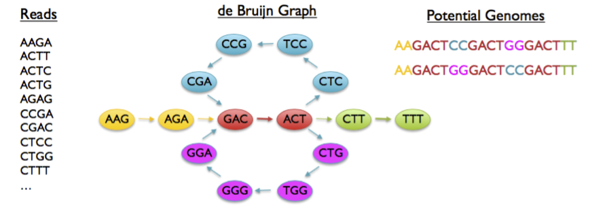
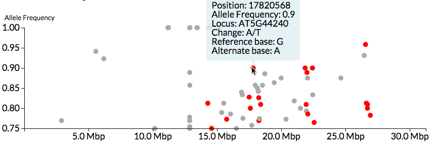

# Genomic Resources and Bioinformatics for Plant Microbe Interactions. {-}

**Led by Dan MacLean**

The increase in the generation and analysis of sequence data in the last ten years has had a profound effect on plant and microbe interaction research. The genomes of the wide range of host and pathogen's of interest are now open to study in a way that is within reach of most scientists - not just large genome sequencing institutes - and many laboratories are now undertaking genomics as a routine approach.

The deluge of data created by new sequencing approaches has been collected into a wide range of general and domain specific databases, each of which contain different information accessed in different ways. Knowing which are the most useful databases in a given context is therefore a tricky question and in this session we will take a tour of the most widely-used including [Ensembl](http://ensembl.org), [PhytoPath](http://phytopathdb.org), [SolGenomics](http://solgenomics.net),  [TAIR](http://arabidopsis.org) and [AraPort](http://araport.org).

Sequence data are used in a wide range of applications and the source molecule will be selected in an application specific way. Genomic DNA is used for assembly of draft genomes, RNA is used for gene expression analysis, genome annotation and exome construction. Both DNA and RNA get used to identify genetic polymorphisms. Mixed populations of nucleic acids from environmental (e.g soil or pathogen/host interaction sites) are used to study species compositions. A wide range of bioinformatics tools have been developed and are in common use for these approaches, so in this topic we will study briefly the tools and their core algorithms and competencies with the aim of helping you to decide on the right tools for any particular analysis that you may wish to do outside of the course. A useful guide is available in @MacLean:2009hm. In particular we will look at algorithms and tools for _de novo_ assembly of sequence including SOAPdenovo [@Luo:2012fn] and [Celera Assembler](http://wgs-assembler.sourceforge.net/wiki/index.php?title=Main_Page). We will study tools for RNASeq expression and annotation analyses including Tophat [@Trapnell:2009dp] and Bowtie [@Langmead:2012jh] and DESeq [@Anders:2010fu] and edgeR [@Robinson:2010cw].

(ref:denovo) Graphical summary of a _de novo_ assembly algorithm. Sequence reads are broken down into constituent _k_-mers and a network of overlapping _k_-mers is produced. The paths in the graph are traversed and the _k_-mers collected into a growing string representing a long sequence in the original data and therefore genome.

```{r mainbio, echo=FALSE, fig.cap="(ref:denovo)", dpi=250 }

```

## Keynote Lecture {-}

### Diane G.O. Saunders - Developing new tools for interrogating cereal invaders {-}

**John Innes Centre, Norwich, UK**

Emerging and re-emerging pathogens pose a continuous threat to food security and human health. Recent advances in next-generation sequencing technologies have provided new opportunities to integrate genomics into the tracking of emerging filamentous plant pathogens. This approach is particularly valuable for analysing rust pathogens, which are frequently obligate biotrophs that cannot be axenically cultured in the laboratory environment. Accordingly, we are leading the genome sequencing of hundreds of isolates of the wheat yellow rust pathogen _Puccinia striiformis f. sp. tritici_ (PST), aimed at improving our understanding of the molecular mechanisms that drive PST evolution. Furthermore, we have developed a robust and rapid “field pathogenomics” strategy to improve filamentous pathogen surveillance. Using gene sequencing of PST-infected wheat leaves taken directly from the field, this technique enabled us to gain insight into the population structure of PST over successive seasons. Our analysis uncovered a dramatic shift in the PST population in the UK and supports the hypothesis that a recent introduction of a diverse set of exotic PST lineages may have displaced the previous populations. Furthermore, we uncovered potential seasonal and varietal specificity for specific genotypes of PST. Our discovery of wheat variety susceptibility to specific _P. striiformis_ isolates that are prevalent at certain times of the year could have considerable impact on directing future disease management approaches.


### About Diane Saunders {-}

> Dr. Saunders received her BSc degree from Exeter University where she continued her studies to PhD level in the pioneering laboratory of Prof. Nick Talbot. After receiving her PhD in 2009 she joined Prof. Sophien Kamoun’s group at The Sainsbury laboratory (TSL) to continue to pursue her interest in the molecular mechanisms that underpin plant-pathogen interactions. Following an early career Leverhulme fellowship at TSL she was awarded a research fellowship from the Earlham Institute and the John Innes Centre to develop her own research group with a focus on emerging and re-emerging plant pathogens. She was then appointed as Project Leader at the John Innes Centre in 2017 where she continues to pursue a multi-disciplinary approach to her research, integrating molecular genetics, microbiology, cell biology, biochemistry, genomics and data mining. In addition, she has worked on three of the most important plant diseases in the world: rice blast, potato late blight, and cereal rusts.

## Practical Session - From Sequence Data to Candidate Gene {-}

**Led by Dan MacLean**

### Aims and Objectives {-}

1. Understand Strengths and Weaknesses of High Throughput Sequence Data
2. Know how to call SNPs from HTS data on 
3. Categorise SNPs according to an expected genetic background

Genomics has come a long way. We can now sequence genomes quickly and to a reasonable degree of accuracy. We can create in a high-throughput manner an inventory of sub-regions in a genome that we think are genes. We know the functions (or some of the functions) of lots of genes and we can infer functions of newly discovered genes by comparison of sequence or structure, basically by seeing whether our new thing looks like something else.

These methods are actually only PREDICTIONS of function. Looking a bit like something else is only a clue to what something does. It frequently fails us.

In this practical we will look at the powerful technique of mutational genomics. This is possibly the coolest thing ever as it involves mutating a living organism so that it is different from other things and then sequencing the genome to pinpoint the exact changes that cause the difference. We don’t have the scope or chemicals to do the mutation bit, so we’ll pick up with the genomics and use Galaxy and Galaxy tools to carry out the analysis that takes us from sequence data to actual candidate mutations in the genome sequence.

With mutational genomics we deal initially with the effect of the gene on the whole organism. By performing mutagenesis on our favourite organism then carrying out a genetic screen [@Page:2002ji] that selects individuals that have changed in the phenotype we are interested in, we have our first foothold on function. We can study those individuals and apply the principles of genetics, use modern high-throughput sequencing and bioinformatics tools to identify the gene causing that phenotype change (or at least ones involved in the process we have messed up).

We will use tools in the Galaxy [@Goecks:2010ea] framework including FastQC for quality control of sequence data [@FastQC], BWA for read mapping and alignment [@Li:2009fi] and CandiSNP [@Etherington:2014ba] to identify candidate mutations (Figure \@ref(fig:candisnp)) .

```{r candisnp, echo=FALSE, fig.cap="CandiSNP visualisation of SNPs", dpi=150 }

```
