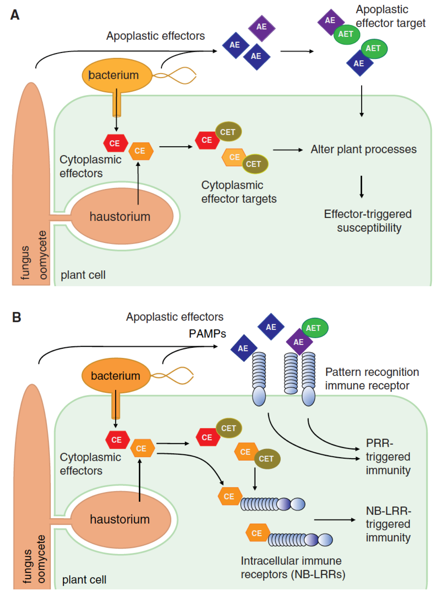

# Effectors and Immunity {-}

**Led by Sophien Kamoun**

One of nature’s many secrets in biology is how filamentous plant pathogens cause disease on their hosts. We are making tremendous progress towards understanding  this process largely due to breakthroughs in “effector biology” [@Hogenhout:2009em; @Win:2012jd]. Effectors are proteins secreted by pathogens to suppress host immune systems and manipulate plant physiology to enable pathogen colonization (Figure \@ref(fig:maineff)A).

(ref:efffig) ***The concept of effectors in plant immunity***. Infectious pathogens such as bacteria, fungi, oomycete, and nematodes deliver effectors at the interface of the host plant (apoplastic effectors, AE) or inside the cell (cytoplasmic effectors, CE). Host-translocated (cytoplasmic) effectors are delivered into the host cytoplasm through a type-III secretion pilus or specialized infectious structures called haustoria that form within the cell. Pathogen effectors traffic to various compartments, bind, and manipulate different host proteins called targets. Depending on their localization in the cells, these targets are designated as apoplastic effector target (AET) and cytoplasmic effector target (CET). Effector–target interactions impact the outcome of the interaction between the pathogen and its host. In susceptible genotypes (A), these molecular interactions can alter plant cell processes and suppress immune responses, leading to effector-triggered susceptibility (ETS) and host colonization. In resistant genotypes (B), these interactions are perceived by key sensing receptors of the immune system that, in turn, stop pathogen growth. Cell surface pattern recognition receptors (PRRs) detect pathogen-associated molecular patterns (PAMPs), apoplastic effectors, and/or apoplastic effector–target interactions to initiate PRRtriggered immunity (PTI). Intracellular nucleotide-binding receptors (NB-LRR) induce NB-LRR-triggered immunity (ETI) on recognition of cytoplasmic effectors and/or cytoplasmic effectors–target interactions (Reproduced from @Win:2012jd).

```{r maineff, echo=FALSE, fig.cap="(ref:efffig)", dpi=400 }

```

We can predict an “effectorome”, or effector repertoire, of a pathogen from its genome sequence based on several criteria that we know about effectors [@Saunders:2012bw]. These criteria include,  presence of a secretory signal peptide, lack of transmembrane domains, lack of mitochondrial targeting signals, presence of known/conserved motifs such as RXLR, upregulation of their transcripts during infection, specific localization in host cells, similarity to known effectors of other plant pathogen species, etc. However, one persistent question is: What are the intrinsic functions of these effectors? To find out, we express tagged effectors in plants and observe their effect on plant morphology and physiology [such as hypersensitive response (HR) cell death] using a technique called the agrobacteria-mediated transient transformation procedure [@Kapila:1997], also known as agroinfiltration. In addition, to work out what these effectors might be doing in plants, we derive clues from the effector-associated plant proteins that we identify by performing co-immunoprecipitation (co-IP) of tagged effectors followed by mass spectrometry (MS) [@Win:2011dw]. These plant proteins constitute potential targets of the effectors. We confirm the association between the effectors and the potential targets in an independent system known as yeast-two-hybrid interaction assays [@Fields:1989dm], or in vitro interaction assays. Once we know the effector targets, we investigate them to find out if they play important roles in plant-pathogen interactions by knocking down their transcripts in plants by virus-induced gene silencing (VIGS) [@Lindbo:1993kp] and observing the effects on plant responses to infection. 

## Keynote Lecture {-}

### Jens Boch - A battle for life and death - Evolution of TALEs in plant-pathogenic _Xanthomonas_ bacteria {-}
**Leibniz Universität Hannover, Institute of Plant Genetics, 30419 Hannover, Germany**

Plant pathogens embark upon a fierce battle with their plant hosts over tissue colonization and nutrient acquisition. This has deadly consequences for both partners of the interaction, but also for us if crop plants are involved. Plant pathogenic _Xanthomonas oryzae_ bacteria can cause substantial losses in rice, making this pathogen a key threat to our food production. Like many other plant pathogens, _Xanthomonas_ bacteria translocate a collection of effector proteins into eukaryotic host cells to function as potent weapons. Among these effectors, TALEs (<u>t</u>ranscription <u>a</u>ctivator-<u>l</u>ike <u>e</u>ffectors) play a pivotal role. TALEs act as transcription factors within the plant cell to induce expression of specific target genes and support the bacterial infection. 
The DNA-binding mechanism of TALEs is unique and based on a number of characteristic 34-amino acid tandem repeats. Each repeat recognizes one base in the target DNA via one precisely positioned amino acid of a repeat-variable diresidue (RVD). This modular architecture allows the rearrangement of TALE repeats to evolve new DNA-binding specificities matching new virulence targets. Whole genome sequences of several _Xanthomonas oryzae_ strains recently revealed both, the diversity and conservation of TALEs in _X. oryzae_. In combination with plant transcript analyses and TALE target prediction we now have an outstanding opportunity to identify TALE virulence targets and decipher the pathogen's strategy. The constant evolutionary battle between pathogen and host has caused evasive mutations in plant promoters that preclude TALE-binding. Matching modifications in TALEs lead to the development of aberrant repeats with novel DNA-binding behaviours. This exemplifies the power of the molecular arms race between pathogen and host.
The simple way of generating any desired DNA-binding specificity has initiated a worldwide use of TALEs for biotechnological applications. Designer TALEs and TALE nucleases (TALEN) have successfully been used for highly efficient genome reprogramming and genome editing. Today, crops and livestock with novel traits as well as powerful tools for molecular medicine have already been developed using TALEs.

Further reading:

  1. @Boch:2009fc Breaking the code of DNA binding specificity of TAL-type III effectors. 
  2. @Richter:2014kz A TAL effector repeat architecture for frame shift binding.
  3. @Grau:2016ft AnnoTALE: bioinformatics tools for identification, annotation, and nomenclature of TALEs from _Xanthomonas_ genomic sequences


### About Jens Boch {-}

> Professor for Plant Biotechnology (2015-present), Leibniz Universität Hannover, Germany
  Assistant/Associate Professor (1999-2015), Martin Luther University Halle-Wittenberg, Germany
  Postdoctoral Fellow (1997-1999), Washington University in St. Louis, USA
  Postdoctoral Fellow (1996-1997), MPI for Terrestrial Microbiology, Marburg, Germany
  Ph.D. (1996), Philipps University Marburg, Germany


## Practical Session - Studying Effector Function _in planta_ {-}

**Led by Joe Win**

We are interested in how plants defend themselves against pathogens, and how the pathogens suppress these defences. Plant immunity is governed by recognition of effectors by plant immune receptors (Figure \@ref(fig:maineff)B). Once recognized, several signalling processes are initiated by the receptors and defence is mounted against the invading pathogen. We have identified a novel network of plant immune components that is involved in defence signalling of Solanaceous plants [@Wu:2016bio]. We study their function and activities by deploying the methods such as co-IP, HR assays and VIGS as described above.

In these practical sessions, we will guide you through the techniques and methods described above to probe plant-microbe interactions with a focus on effectors and plant immunity.

### Aims and Objectives {-}

  1. To be familiar with current knowledge of effectors and their roles in infection of host plants.
  2. To understand the roles of helper components in plant immune signalling network.
  3. To understand the theory and practice of methods and techniques that are routinely used to study effectors and plant immunity

In this practical session, you will be invited to choose one of the following techniques for hands-on experience guided by the instructors.

  1. In planta co-immunoprecipitation of effectors and associated plant proteins, and analysis of effector-plant protein interactions _in vitro_
  2. Yeast two-hybrid assay to study protein-protein interaction
  3. Agroinfiltration and virus-induced gene silencing to study gene functions in plants
