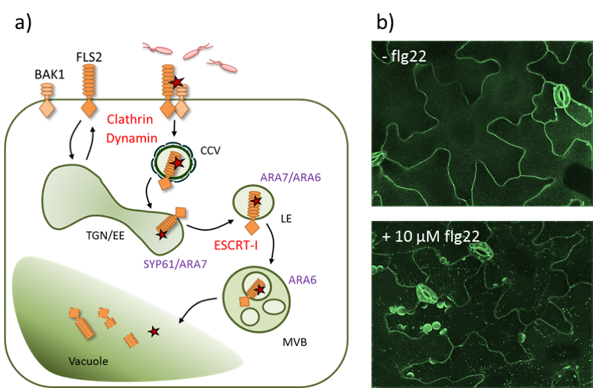

# Cellular Defence {-}

**Led by Silke Robatzek**

In recent years the importance of PRR subcellular trafficking to plant immunity has become apparent. PRRs are secreted through the endoplasmatic reticulum (ER) and the Golgi apparatus to the plasma membrane, where they recognize their cognate ligands. At the plasma membrane, PRRs can be recycled or internalized via endocytic pathways. The endocytic pathway in plants comprises early and late endocytic compartments.

FLS2 constitutes a well-known example to study endocytic trafficking. From the PM FLS2 is internalized in a clathrin-dependent manner and targeted towards distinct subcellular fates in dependence of its activation status. At the stage of the trans-golgi-network (TGN)/ early endosome (EE) non-activated FLS2 is recycled back to the plasma membrane. Activated (flg22-bound) FLS2 is sorted to the late endosomal pathway and internalized into intra-luminal vesicles of multi-vesicular bodies (MVBs) destined for vacuolar degradation, which is regulated by the <u>e</u>ndosomal <u>s</u>orting <u>c</u>omplexes <u>r</u>equired for <u>t</u>ransport (ESCRT) sorting machinery (See Figure \@ref(fig:srfig) a).

Mutants lacking clathrin- or ESCRT- components are more susceptible to bacterial infection, indicating the importance of endomembrane trafficking regulators for the establishment of efficient defence responses. 

Small Rab GTPases and Syntaxins act at multiple stages of vesicle trafficking, including cargo selection, vesicle formation, vesicle movement, tethering and membrane fusion. Distinct members of these families are associated with specific membrane compartments. Therefore these proteins, such as the Rab5 GTPases ARA6 and ARA7 or the syntaxin SYP61 which are localised at the MVB/LE-, EE/LE and TGN, respectively), can be used as marker proteins to identify specific membrane compartments. 

## Keynote Lecture {-}

### Paul Birch - Keynote Speaker Title {-}
**James Hutton Institute, Dundee, UK**

### About Paul Birch {-}

> bio bio bio

## Practical Session - Live Cell Imaging and Investigation of Subcellular Membrane Trafficking  {-}

**Led by** [Gildas Bourdais](gildas.bourdais@sainsbury-laboratory.ac.uk), [Michaela Kopischke](michaela.kopischke@sainsbury-laboratory.ac.uk), [Agnieszka Siwoszek](agnieszka.siwoszek@sainsbury-laboratory.ac.uk), [Jelle Postma](jelle.postma@sainsbury-laboratory.ac.uk), [Katarzyna Rybak](katarzyna.rybak@sainsbury-laboratory.ac.uk), [Janina Tamborski](janina.tamborski@sainsbury-laboratory.ac.uk)

### Aims and Objectives {-}

  1. Perform advanced fluorescence imaging using confocal laser scanning and spinning disc microscopy
  2. Generate images suitable for qualitative and quantitative analyses
  3. Provide a tool-box to understand and study the plant’s endomembrane trafficking machinery

In the practical sessions we will investigate the (co-)localisation of FLS2-GFP and various endosomal marker proteins following flg22 treatment using live-cell imaging approaches (See Figure \@ref(fig:srfig) b). Chemical inhibitors and genetic interference with the endomembrane trafficking machinery will help us to dissect and understand the route of activated FLS2 in a temporal and spatial resolution. 

(ref:srfigcap) FLS2 endocytsosis. **a)** The PRR FLS2 and its co-receptor BAK1 localise at the plasma membrane. Upon flg22 perception, a receptor complex is formed and the activated receptor is internalised into clathrin-coated vesicles (CCV) and sorted into intraluminal vesicles of multi-vesicular bodies (MVBs) via the trans-Golgi-network (TGN)/early endosomes (EE) and the late endosomes (LE). Components required for FLS2 internalisation and sorting are indicated in red, endosomal marker proteins are indicated in lilac. **b)** Confocal micrographs (spinning disc microscopy) of FLS2-GFP before and after elicitation with flg22.

```{r, srfig, fig.cap="(ref:srfigcap)", dpi=150, echo=FALSE}

```
