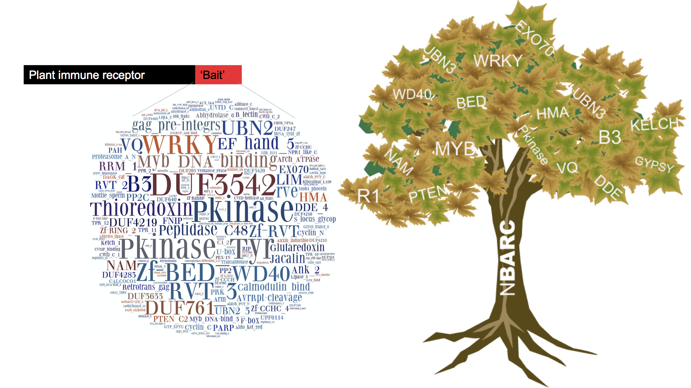

# Fuctional Plant Genomics {-}

**Led by Ksenia Krasileva**

*Adopting new wheat genomic tools to dissect plant innate immunity*

Almost every week a new plant genome becomes available. Expansion of genomic data is mostly due to recent advances in sequencing technologies that have greatly leveraged the field between model and non-model organisms. Bread wheat (_Triticum aestivum_) is a plant of immense agronomic value with a highly complex 17 Gb allohexaploid genome. Recent development of new sequencing and genome assembly approaches greatly reduced the time and resources needed to assemble wheat genome and 6 genomes of different wheats are already available, allowing for in depth comparative analyses. Moreover, development of exome capture assay (targeted sequencing of gene space) allowed establishing reverse genetics resources for wheat as well as rapid mapping-by-sequencing identification of mutations from forward genetic screens.

```{r mainwg, echo=FALSE, fig.cap="The NLR Integrated Domain Paradigm", dpi=96 }

```

Availability of genome of wheat and many other plant species allowed us to elucidate evolutionary history of plant immune receptors of Nucleotide-Binding Leucine Rich Repeat class (NLRs). A recent paradigm in NLR-based recognition of pathogen derived effectors involves NLRs with exogenous integrated domains (NLR-IDs) that can serve as baits for effectors by mimicking plant proteins that pathogens target. We have shown that NLR-IDs are prevalent across flowering plants and identified their ID repertoires. This information now allows us to a) search for new effectors b) predict host susceptibility genes normally targeted by pathogens (Figure \@ref(fig:mainwg)). 

\newpage

## Keynote Lecture {-}

### Daniel Croll - Retracing genome evolution of pathogens during rapid disease emergence in agricultural ecosystems {-}
**University of Neuchâtel, Switzerland**

Most plants face attacks by pathogens. In agriculture, outbreaks of fungal diseases are frequent and pose a significant threat to sustainable food production. What enables pathogens to overcome host defenses and cause damage is poorly understood. A key evolutionary step for pathogens is to evolve effectors that specifically target and disable the plant immune system. We use experimental and population genomics tools to identify the genes underlying pathogenicity. Our main model is the fungus _Zymoseptoria tritici_, which causes one of the most important diseases on wheat. Based on large collections of sequenced pathogen genomes, we performed genome-wide association studies (GWAS) to identify the genes linked to the breakdown of host resistance. These genes encoded small secreted proteins that were highly expressed during plant infection. Then, we assembled reference-quality genomes to analyze the chromosomal regions surrounding effector genes. We found that these regions were undergoing rapid chromosomal sequence evolution driven by repetitive elements. We found substantial gene deletion polymorphism segregating in pathogen populations and, hence, functional differences among pathogen strains. Genes located in highly dynamic chromosomal regions provide pathogen populations with evolutionary potential to rapidly adapt to environmental changes or new hosts.

### About Daniel Croll {-}

> Daniel Croll joined the University of Neuchâtel, Switzerland, in 2017 where he leads the Laboratory of Evolutionary Genetics as an Assistant Professor. Daniel Croll received his MSc in Biology in 2003 and his PhD in Life Sciences in 2009 from the University of Lausanne, Switzerland. He then joined the ETH Zürich as a postdoctoral fellow. Later, he received an Advanced Postdoctoral Fellowship from the Swiss National Science Foundation to work 2013-2014 at the University of British Columbia in Vancouver, Canada. In 2015, Daniel Croll was appointed as an Oberassistant (group leader) and lecturer at the ETH Zürich. At the University of Neuchâtel, Daniel Croll continues to investigate the evolutionary dynamics of disease emergence in agricultural ecosystems. The main interests include the dissection of phenotypic traits using genome-wide association mapping, the mechanisms of rapid genome evolution and the signatures of recent adaptive evolution.

\newpage

## Practical Session - Functional Plant Genomics {-}

**Led by Erin Baggs and Elisha Thynne**

### Aims and Objectives {-}

1. Become familiar with web-servers and command line tools for protein family analyses
2. Understand  how to produce and critically assess a local sequence alignment and phylogeny
3. Be able to scan genomes for sequences with particular domains and understand their evolutionary origin

The aim of this practical session is to analyse given NLR-IDs as examples of proteins with complex evolutionary histories and be able to robustly identify the origins of integrated domains. Each student will be given an NLR-ID sequences previously identified from our genomic screens, and will analyse the origin of IDs through genomics and phylogenetics, predicting what parental gene it might have originated from. We will also guide you through  how to run our r_gene NLR-ID scan pipeline (Sarris et al 2016) on a new genome which will allow you to identify all NLRs and all NLR-IDs from a given proteome. By the end of the practical we hope you should be able to investigate evolutionary history of a protein and gain skills in protein family analyses.

The practical will be centred around a biological question of identifying the origin of integrated domains and predicting parental genes from which they are derived. The parental genes may in some instances represent potential pathogen targets, in which are case they could be considered host susceptibility genes. The practical will be organized in exercises in different levels to match your skillsets. Our exercises will take you through the steps of identifying conserved domains present in a protein of interest and show you how to identify all sequences in an organism of interest with that domain. Then we will show you how these sequences can form the basis for an alignment from which you can generate a phylogeny. At all steps we will highlight tools, such as BioMart, which will allow you to complete the task with little bioinformatic skill required. The session will also offer the chance to use command line tools and scripts available on github which allow for greater flexibility and control over the data you generate. The practicals modular composition should allow you to apply many of the tools introduced to you to your own biological questions. 

At the end of the session, we can demonstrate how you can obtain a knockout of your identified putative susceptibility gene in wheat by using www.wheat-tilling.com reserse genetics resource.

