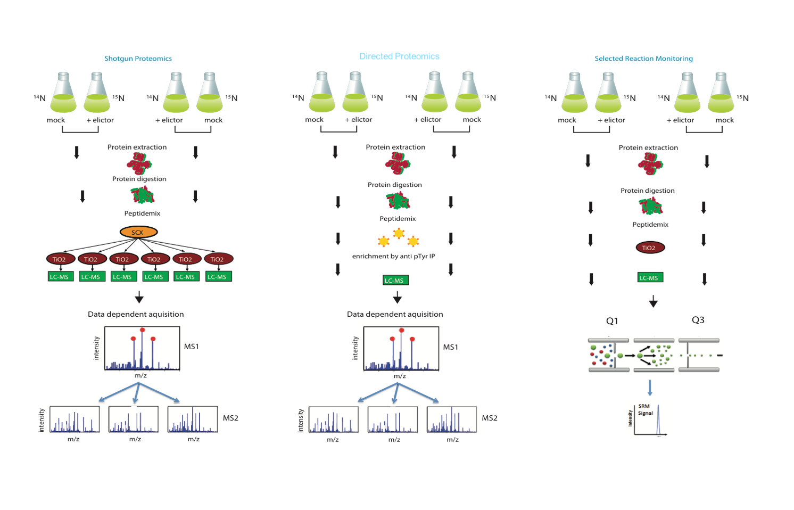
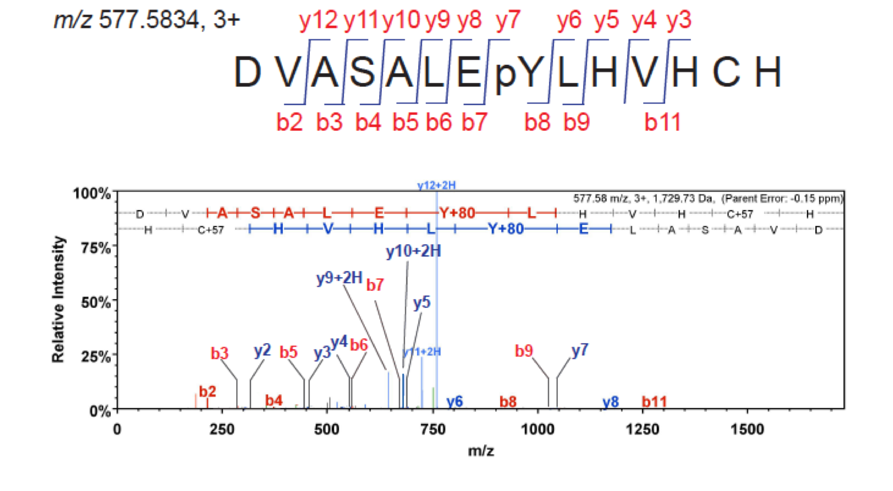

# Application of Discovery and Targeted Proteomics in Plant Pathogen Interactions {-}

**Led by Frank Menke**

The field of proteomics is rapidly advancing, driven in part by technological innovation and the design of sophisticated approaches to target a specific biological question. Proteomics is a broad term that covers the large-scale analysis of proteins and their modifications (the proteome) in a given cell, tissue or organism under a defined condition. While this could involve a diverse set of approaches including molecular biology, biochemistry and genetics, in practise it mostly refers to protein purification and analysis by mass spectrometry [@Aebersold:2016kt].

Current developments in the proteomics field are very exciting and discovery (or shotgun) proteomics data sets are becoming more comprehensive with more sensitive hybrid mass spectrometers. Furthermore, targeted proteomics approaches, such as Selective Reaction Monitoring [@Picotti:2013jp] have made it possible to reproducible and accurately test a biological hypothesis (impossible with shotgun proteomics at the moment) and bring hands-on proteomics to biologists. 

This session will cover the basics of proteomics, including introduction to mass spectrometry and experimental design. We’ll look at both discovery and targeted proteomic workflows and how these can be used in studying plant pathogen interactions. See Figure \@ref(fig:mainp). 

## Keynote Lecture {-}

### Delphine Pflieger - Quantitative phosphoproteomic analysis reveals shared and specific targets of Arabidopsis MAPkinases MPK3, MPK4 and MPK6 {-}

**Commissariat à l'énergie atomique et aux énergies alternatives (CEA), Grenoble, France**

In Arabidopsis, mitogen-activated protein kinases MPK3, MPK4 and MPK6 constitute essential relays for a variety of functions including cell division, development and innate immunity. While some substrates of MPK3, MPK4 and MPK6 have been identified, the picture is still far from complete.
To identify the substrates of these MAPKs in cell division, growth and development we compared the cytosolic and chromatin-linked phosphoproteomes of wild-type and mpk3, mpk4 and mpk6 mutant plants. To study the function of these MAPKs in innate immunity, we analyzed their phosphoproteomes following activation by a microbe-associated molecular pattern (MAMP).
We identified 152 differentially phosphorylated peptides in cytosolic fractions, in response to MAMP treatment and/or when compared between genotypes. 70 of these could be classified as putative MAPK targets, with phosphosites that are specific to one or shared by several MAPKs. Biochemical analysis of a number of putative MAPK substrates by phosphorylation and interaction assays confirmed our global phosphoproteome approach. Finally, we examined in detail the unknown function protein AYL1 (AT5G43830), confirming that it is a MAPK target and plays a role in defense responses. The results obtained on the fraction of chromatin-linked phosphoproteins confirm the picture obtained in the cytosol: in particular, the most dramatic effect on the phosphoproteome is observed in the mpk6 deletion mutant. 
In conclusion, partially overlapping substrate networks were retrieved for all three MAPKs, showing target specificity to one, two or all three MAPKs in different biological processes. Interestingly, we unveil the fact that within a given protein substrate, different phosphosites may be modified by one specific MAPK or by several of the three MAPKs. Our study also expands the set of novel MAPK substrates and functions to other involved protein kinases, including calcium-dependent (CDPK) and sugar non-fermenting (SnRK) protein kinases.

### About Delphine Pflieger {-}

> Delphine Pflieger is a French researcher who followed the boom of proteomics since the early 2000s, by defending a PhD in 2004 on the use of the coupling between liquid chromatography and mass spectrometry (LC-MS) as a very robust and versatile approach for protein sample characterization. After completing her PhD of Analytical Chemistry in Paris (University Paris VI), she joined the group of Prof. Ruedi Aebersold, starting at the Institute for Systems Biology in Seattle and then participating in the establishment of a new laboratory in ETH Zürich. During this post-doctoral experience, she was in particular interested in developing a proteomics method to better study imperfectly affinity-purified protein complexes and their phosphorylations. In 2006, she got a researcher position at CNRS (Centre National de Recherche Scientifique) in Evry, in the Parisian suburb. In tight collaboration with the group of Heribert Hirt, she developed there phosphoproteomic analyses to decipher the signaling cascades triggered in _Arabidopsis thaliana_ when the plant is subjected to a simulation of pathogen attack. The team analyzed the cytosolic part of the cascades but also gave a special focus on the events occurring in the vicinity of chromatin, to connect the very end of the signaling pathways with the rewiring of the transcriptional program [@Bigeard:2014bl; @Bigeard:2014df; @Rayapuram:2014dc]. This collaborative work is still on-going. Since her move to Grenoble in September 2014, Delphine Pflieger however developed new interests in the more specific analysis of histones, key constituents of chromatin, both in terms of variants and of their multiplicity of post-translational modifications. 

\newpage

```{r mainp, echo=FALSE, fig.cap="Discovery and targets proteomics workflows", dpi=250}

```

## Practical Session - Analysing and interpreting mass spec data  {-}

**Led by Frank Menke**

### Aims and Objectives {-}

1. Understanding how mass spec data analysed
2. learning how to interpret targeted proteomics data

Extracting raw data acquired by mass spectrometry to obtain an interpretable protein list is achieved by step-wise processing of the data files through a variety of purposely built open source and commercial software. The first tutorial will cover discovery proteomics and introduces basic concepts and frequently used data pipelines. Using actual data collected on TSL mass spectrometers, we will introduce the most important parameters and variables in data processing, and describe individual steps of the processing pipeline. We will create textual input for the search engine, and commence the search to interpret tandem mass spectra. This will result in a list of identified peptides, their sequences, and list of proteins. We will then interpret the results using several software that include web based search engine output, Scaffold, and data export to tabular format for further processing and visualization (Figure \@ref(fig:pracp) ).

```{r pracp, echo=FALSE, fig.cap="Interpretation of a MS2 spectrum", dpi=250}

```

The second tutorial will cover targeted proteomics and analysis of Selected Reaction Monitoring (SRM) data in Skyline. In this elementary introduction to Skyline, students will build a spectral library, create a background proteome, import SRM data files and adjust settings to allow data refinement, analysis and interpretation. 
