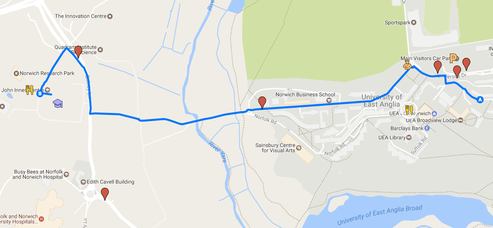

# General Information {-}

## Arriving into Norwich {-}

### Arriving by Air {-}

**Norwich International Airport**

[Norwich International Airport](http://www.norwichairport.co.uk/) is served by [KLM](http://www.klm.com/) and the regional carriers [Flybe](http://www.flybe.com/), [BMI Regional](http://www.bmiregional.com/), and [Eastern Airways](http://www.easternairways.com/), with direct connections to Amsterdam, Manchester, Edinburgh, and Aberdeen. Form the airport you can take a taxi or [local bus](http://www.travelineeastanglia.org.uk/ea/XSLT_TTB_REQUEST?language=en&command=direct&net=ea&line=21603&sup=%20&project=y08&outputFormat=0&itdLPxx_displayHeader=false&lineVer=1&itdLPxx_spTr=1) (with transfer) to get to the Norwich Research Park. Note that if you fly out of Norwich airport you will need to pay a [£10 Airport Development Fee](http://www.norwichairport.co.uk/content.asp?pid=92) before you can go to your gate.  Norwich airport is, however, a very convenient way to reach Norwich from outside the UK.

**London Airports**

You can also arrive at any of the London airports and take a train or coach to Norwich. Stansted Airport is the closest and has direct rail connections to Norwich.

### Arriving by Train {-}

Another option, especially if you are based in the UK, or are arriving at another airport, it to take Britain’s national train network to [Norwich Train Station](http://www.nationalrail.co.uk/stations_destinations/NRW.aspx), located in downtown Norwich. From there you can take a local bus or a taxi to Norwich Research Park. [National Rail](http://www.nationalrail.co.uk/) and [TheTrainLine](http://www.thetrainline.com/stations/norwich) are two comprehensive online resource for booking train travel within the UK.

### Arriving by Coach {-}

You can also arrive in Norwich via coach. [Norwich Bus Station](http://www.norfolk.gov.uk/Travel_and_transport/TravelNorfolk/Buses/Bus_interchanges_and_stops/NCC155388) is downtown and is also served by local buses and taxis once you arrive.

### Arriving by Car and Parking {-}

See the [Sainsbury Laboratory](http://www.tsl.ac.uk/contact/) and [UEA](https://www.uea.ac.uk/about/visiting-staying/getting-here) _getting here_ pages.

Parking at the Conference Centre is “[ample and free for all events](http://www.venue-norwich.info/FAQs.html)”. If you require parking at the conference venue, please use the JIC Visitor’s car park (follow the signs we will put up). When you are at registration, please tell us your license plate number, make, and colour so we can register it with JIC security.

Those staying at UEA will be able to park in the Main car park on campus. Parking will be available in the Main car park on campus. UEA car park charges are listed on the [UEA car parking for visitors](https://portal.uea.ac.uk/estates/travel-and-transport/by-car/parking-for-visitors) page


### Getting from and into Central Norwich by Bus {-}

[First Group](http://www.firstgroup.com/ukbus/suffolk_norfolk/journey_planning/maps/) is the major local bus provider in Norwich. [This map shows the complete network](http://www.firstgroup.com/ukbus/suffolk_norfolk/assets/pdfs/journey_planning/maps/norwich_map.pdf), and these buses specifically serve the Norwich Research Park or the UEA campus:

*   **[11/12](https://www.firstgroup.com/norfolk-suffolk/plan-journey/timetables/?operator=22&service=11/12&page=1&redirect=no)**: Can catch these routes by walking down Colney Lane, towards the Hospital, and at the first bus stop past the roundabout.
*   **[13/13A/13B/13C/X13](https://www.firstgroup.com/norfolk-suffolk/plan-journey/timetables/?operator=22&service=13/13A/13B/13C/X13&page=1&redirect=no)**: Can catch these routes by walking down Colney Lane, towards the Hospital, and at the first bus stop past the roundabout.
*   **[21/21A/22](https://www.firstgroup.com/norfolk-suffolk/plan-journey/timetables/?operator=22&service=21&page=1&redirect=no)**: Can catch these right outside Norwich Research Park, on Colney Lane.
*   **[25](https://www.firstgroup.com/norfolk-suffolk/plan-journey/timetables/?operator=22&service=25&page=1&redirect=no)**: Goes from the rail station through the UEA campus, all the way to the end of Chancellor’s Drive.
*   **[26/26A](http://www.firstgroup.com/ukbus/suffolk_norfolk/journey_planning/timetables/index.php?operator=22&service=26&page=1&redirect=no)**: Goes from the rail station to University and nearby hospital. Can catch the 26 right out Norwich Research Park, on Colney Lane.
*   
These bus stops have been added to the [Summer School Google Map](https://drive.google.com/open?id=1z7gP4EFxyaGBmp69A2woREZWNj0&usp=sharing)<a>.</a>


## Checking into Accomodation {-}
Accommodation will be at the UEA, Britten House. Check in will be at the UEA Security Lodge at any time from 2pm on the day of your arrival. 

## Meals {-}

### Breakfast and Lunch {-}

Breakfast in the Zest Restaurant is served each day from 8 am to 9 am. Lunches can be purchased from The Centrum building on site, a range of salads, sandwiches, soups and hot meals are available. Coffee, tea and other beverages will be available during breaks.

### Evening Meals {-}

Evening meals are self catered. The official conference dinner is on Friday 4th August. 

#### Dining Out {-}

Norwich is a compact, walkable city with abundant restaurants and cafes. Head to either Rampant Horse Street area, The Lanes, or the Tombland area.

UEA Restaurant facilities on campus provide everything from a simple coffee and sandwich to a full meal at eateries Blend, Zest, Vista, Café Direct, Cafe 57 and the Sainsbury Centre for Visual Arts Gallery Café, though these have restricted opening times, usually until 8pm only and especially outside of terms.

#### Dining In {-}

The lodging buildings each have a shared kitchen and you will be able to prepare small meals there. There is a small supermarket on site in the main plaza, a short walk from the lodging. There are also three supermarkets just off campus and within walking distance. These are marked on the included map.

## Getting Around {-}

Lodging is at The University of East Anglia, in Britten House. Parking is available in the main campus car park. There is a custom Google Map with all venues and Norwich Airport and train and bus stations: [Summer School Map](https://drive.google.com/open?id=1z7gP4EFxyaGBmp69A2woREZWNj0&usp=sharing)


## Site Registration {-}

On the first morning of The Summer School, please go to the John Innes Centre Reception for 10 am. We can then sign you into the register on-site and show you to the training rooms. 

## Emergency Contacts {-}

### Internal Emergency First Aid {-}

Dial **333**, ask operator for a First Aider or an ambulance. Or dial **9 999** for emergency services directly.

### Hospital {-}

The Norfolk and Norwich University Hospital is directly located on the Norwich Research Park: Colney Lane, Norwich, NR4 7UY. Tel: 01603 286286.

## Transport {-}

  * Taxis – Goldstar Taxis 01603 700700 or ABC Taxis 01603 666333
  * Bus - First Group is the major local bus provider in Norwich and these buses specifically serve the Norwich Research Park or the UEA campus:
*   **[11/12](https://www.firstgroup.com/norfolk-suffolk/plan-journey/timetables/?operator=22&service=11/12&page=1&redirect=no)**: Can catch these routes by walking down Colney Lane, towards the Hospital, and at the first bus stop past the roundabout.
*   **[13/13A/13B/13C/X13](https://www.firstgroup.com/norfolk-suffolk/plan-journey/timetables/?operator=22&service=13/13A/13B/13C/X13&page=1&redirect=no)**: Can catch these routes by walking down Colney Lane, towards the Hospital, and at the first bus stop past the roundabout.
*   **[21/21A/22](https://www.firstgroup.com/norfolk-suffolk/plan-journey/timetables/?operator=22&service=21&page=1&redirect=no)**: Can catch these right outside Norwich Research Park, on Colney Lane.
*   **[25](https://www.firstgroup.com/norfolk-suffolk/plan-journey/timetables/?operator=22&service=25&page=1&redirect=no)**: Goes from the rail station through the UEA campus, all the way to the end of Chancellor’s Drive.
*   **[26/26A](http://www.firstgroup.com/ukbus/suffolk_norfolk/journey_planning/timetables/index.php?operator=22&service=26&page=1&redirect=no)**: Goes from the rail station to University and nearby hospital. Can catch the 26 right out Norwich Research Park, on Colney Lane.
   
These bus stops have been added to the [Summer School Google Map](https://drive.google.com/open?id=1z7gP4EFxyaGBmp69A2woREZWNj0&usp=sharing)<a>.</a>

## Norwich and Norwich Research Park {-}

At the heart of East Anglia Norwich is a vibrant inviting city. Steeped in historic charm; The Cathedral, The Castle, the most complete medieval street pattern in the UK, the largest collection of pre-reformation churches in Northern Europe and the oldest hotel in the UK are all situated in Norwich. In medieval times Norwich was the second largest city in England. Norwich has the largest open-air market in England plus its own mustard “Colmans mustard” and Norwich City Football Club, The Canaries. In 2012 Norwich became a UNESCO city of literature. Norwich has a fantastic surrounding countryside including the Broads and Norfolk coast. 

The Norwich Research Park, with six independent partner institutions; UEA, The John Innes Centre, Earlham Institute, Quadram Institute, Norfolk and Norwich Hospital and The Sainsbury Laboratory. Norwich Research Park is ranked fourth in the UK for the number of internationally recognised scientists. UEA has the second highest graduate retention rate in the country with almost half of all graduates living and working locally. 

## Wifi Connections {-}

Wifi is available throughout the site. If you have EDUROAM available, please use that.
If you don’t have EDUROAM, you can get guest wireless passes from The John Innes Centre Reception.

## Social Media {-}

Tweeting and other social media activity are encouraged. `#tslsummerschool`, `@TheSainsburyLab`

## Map {-}

A live Google Map with useful sites marked is available [here](https://drive.google.com/open?id=1z7gP4EFxyaGBmp69A2woREZWNj0&usp=sharing)

A static version is presented below.

```{r map, echo=FALSE, dpi=200 }

```

## Excursion {-}

Sunday is a day of relaxation and we have booked a trip to the north Norfolk coastal town of Cromer. Perched on the very edge of the north Norfolk coast, Cromer is famous for its tasty crabs, wide open beaches, a traditional pier complete with a theatre providing seaside special variety shows and is awash with small local independent shops. The town offers a wide choice of restaurants and cafes with not a single coffee shop chain or national eating or drinking venue to be found. Instead you have cafes, bars and restaurants owned and operated by local residents all eager to serve both local residents and visiting guests. The bus will depart at 1100 am from John Innes Reception.

Later in the day, we have booked a boat in the nearby village of Morston to take us for a 1 hour trip out on Blakeney Point to see the population of seals that live there. The boat will leave at 16:45 and the bus will drop off at Morston from Cromer. 


